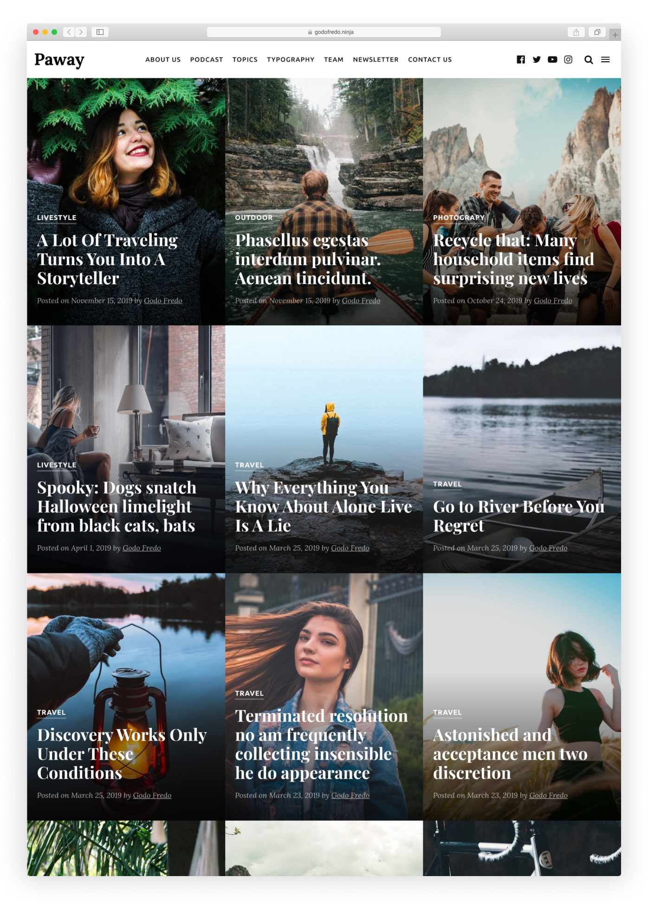

# Paway free theme for [Ghost](https://github.com/tryghost/ghost/)

> For fancy people, Photographers and Travel Lovers

Paway theme is for photo blog writers and for those who like to share their stories in a simple and elegant way. The theme has a clean and modern design, using all the browser screen space.
It is suitable for any kind of blog: personal, fashion, food, travel, photography.

&nbsp;

## Demo

See the screenshot on [behance](https://www.behance.net/gallery/89704867/Paway-For-fancy-people-Photographers-and-Travel-Lover)

## Featured

- Support for different [languages](http://themes.ghost.org/docs/i18n#section-how-to-add-any-language) (en - es)
- [AMP](https://github.com/godofredoninja/Hodor-AMP-Ghost) Template
- Responsive Layout
- Tag Page
- Site Navigation
- Related Articles (3 articles)
- Links to Social Media
- Page 404
- Native Comments
- Native Search
- Buttons to share the article (Facebook - Twitter - Reddit - Linkedin)
- YouTube, Vimeo, kickstarter, dailymotion => Responsive
- Lazy load Image for better performance
- [Theme Translation](#theme-translation)
- [AMP](#amp)

## Theme Translation

> Paway supports

- `en` — English default language
- `es` — Spanish

if you want to have in another language you just have to copy `locales>en.json` and rename the file then translate to your favorite language:

Just enter the [language/locale tag](https://www.w3schools.com/tags/ref_language_codes.asp) of the files to use (e.g.: `fr.json` for French, `zh.json` for Chinese, `ja.json` for Japanese)

## AMP

— *Paway has a nice page for **AMP***

- Navigation
- links to followers in social media
- Tags
- Related Articles (6 articles)
- Buttons to share the article (Facebook - Twitter - Whatsapp)

To customize the AMP page [read here](https://github.com/godofredoninja/Hodor-AMP-Ghost)

### Credits

- [Hodor AMP](https://github.com/godofredoninja/Hodor-AMP-Ghost)
- [Normalize](https://necolas.github.io/normalize.css/)
- [Lazysizes](https://github.com/aFarkas/lazysizes)
- [lightgallery.js](https://github.com/sachinchoolur/lightgallery.js/)
- [Fonts](https://fonts.google.com/?query=lor&selection.family=Lora|Playfair+Display)
- [Safari Light - Mockup](https://www.uplabs.com/posts/safari-light-version)

## Copyright & License

Copyright (c) 2019 GodoFredo - Released under the [GPLv3 license](LICENSE)
