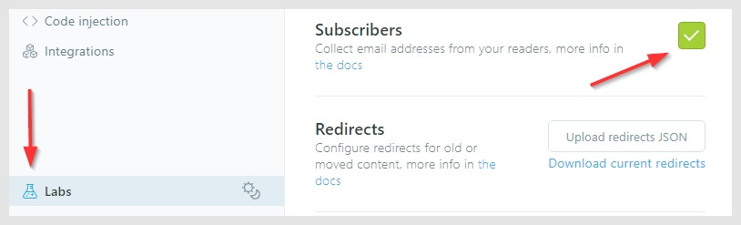
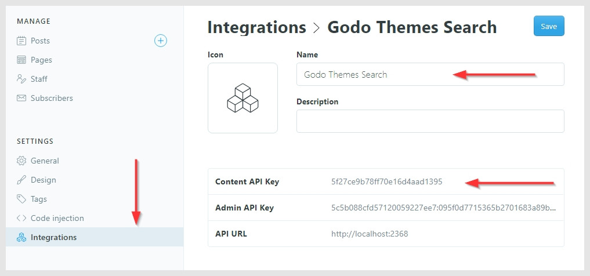

# Paway free theme for [Ghost](https://github.com/tryghost/ghost/)

[](https://github.com/TryGhost/Ghost)
[](https://www.paypal.me/godofredoninja)

> For fancy people, Photographers and Travel Lovers

Paway theme is for photo blog writers and for those who like to share their stories in a simple and elegant way. The theme has a clean and modern design, using all the browser screen space.
It is suitable for any kind of blog: personal, fashion, food, travel, photography.

## Please help me. I met a girl on the Internet and we are a couple, now I want to travel to her country.  The money will be used for travel expenses

### The campaign is being launched on [https://www.gofundme.com/](https://www.gofundme.com/manage/por-favor-ayudame-quiero-conocer-a-worapitcha/). Here is the link where you can learn more about my story

[Help me. I want to travel and meet Worapitcha](https://www.gofundme.com/manage/por-favor-ayudame-quiero-conocer-a-worapitcha)

### You can also help me with donations in [PayPal](https://www.paypal.me/godofredoninja). If you don't have Paypal you can do it through [this link](https://www.paypal.com/cgi-bin/webscr?cmd=_s-xclick&hosted_button_id=LJBVP2C9HTCSY&source=url)

### Please, I tell you with my heart, help me

[](https://www.paypal.me/godofredoninja)

---

&nbsp;


## Featured

- Support for different languages
- [AMP](https://github.com/godofredoninja/Hodor-AMP-Ghost) Template
- Responsive Layout
- Site Navigation
- Related Articles (3 articles)
- Links to Social Media
- Instagram Feed random
- Page 404
- Disqus Comments
- Buttons to share the article (Facebook - Twitter - Reddit - Linkedin - Pinterest)
- YouTube, Vimeo, kickstarter, dailymotion => Responsive
- Lazy load Image for better performance only in backgrounds
- Code syntax [Prismjs](http://prismjs.com/index.html#languages-list) Supported all syntax.

## Table of Contents

- [Ghost Settings](#ghost-settings)
- [Paway Settings](#paway-settings)
  - [Social Media](#social-media)
  - [Instagram](#instagram)
  - [Comments](#comments)
  - [Search](#search)
- [Theme Translation](#theme-translation)
- [AMP](#amp)
- [PrismJS code syntax](#prismjs-code-syntax)

## Ghost Settings

Enable the following checkboxes on the Labs page in the Ghost admin panel -> Settings



## Paway Settings

You don't have to add all the Paway configurations. only the ones you need

### Social Media

**Facebook and Twitter** is not necessary because I use them from the ghost settings

Add the Social Links only for the services you want to appear in the header section of your website. Pay attention as enabling too many services will cause menu problems.

👉 `Admin panel -> Settings -> Code Injection -> Site Footer`

```html
<script>
  var followSocialMedia = {
    'youtube': 'https://...',
    'instagram': 'https://...',
    'snapchat': 'https://...',
    'dribbble': 'https://...',
    'github': 'https://...',
    'linkedin':'https://...',
    'spotify':'https://...',
    'codepen':'https://...',
    'behance':'https://...',
    'flickr':'https://...',
    'pinterest':'https://...',
    'telegram':'https://...',
    'rss':'https://...',
  };
</script>
```

### Instagram

I get the last 10 images then show 6 randomly It will only be shown in the footer

First, you will need to get your account `userName` and `userId` and `accessToken` from the following URLs:

- userId: [codeofaninja.com/tools/find-instagram-user-id](https://codeofaninja.com/tools/find-instagram-user-id)
- accessToken: [instagram.pixelunion.net](http://instagram.pixelunion.net/)

👉 `Admin panel -> Settings -> Code Injection -> Site Footer`

```html
<script>
  var instagramFeed  = {
    token: 'Token_app_instagram',
    userId: 'User_ID',
    userName: 'User_Name',
  };
</script>
```

### Comments

Paway supports Disqus comments. First, you will need to get your account `disqusShortName`

👉 `Admin panel -> Settings -> Code Injection -> Site Footer`

```html
<script>
  var disqusShortName = 'YOUR_DISQUS_SHORTCUT_HERE';
</script>
```

### Search

The default search engine will only search the titles of the post

 — **Setup a Custom integration**

1. Go in your Ghost's dashboard `Settings -> Integrations -> Add custom integration`
2. Set a name: GodoFredo Themes Search
3. Get the Content API Key and replace the demo key with this one
4. Get the admin domain. This will be different in some cases



👉 `Admin panel -> Settings -> Code Injection -> Site Footer`

```html
<script>
  var searchSettings = {
    key: 'ADD_YOUR_CONTENT_API_KEY',
    host: 'https://your-domain.com',
  };
</script>
```

## Theme Translation

**Paway supports:**

- `en` — English default language
- `es` — Spanish


if you want to have in another language you just have to copy `locales>en.json` and rename the file then translate to your favorite language:

Just enter the [language/locale tag](https://www.w3schools.com/tags/ref_language_codes.asp) of the files to use (e.g.: `fr.json` for French, `zh.json` for Chinese, `ja.json` for Japanese)

## AMP

— *Paway has a nice page for **AMP***

- Navigation
- links to followers in social media
- Tags
- Related Articles (6 articles)
- Buttons to share the article (Facebook - Twitter - Whatsapp)

To customize the AMP page [read here](https://github.com/godofredoninja/Hodor-AMP-Ghost)

### PrismJS code syntax

> It is very important to add your code in the block of `Markdown`

Make your code stand out. WIth the PrismJS code highlighter. PrismJS allows you to select which languge you embeded and performs code highlighting according to the language. Neat!

Take a look at the [Prismjs Supported Language List](http://prismjs.com/#languages-list) to find your coding language.


### Credits

- [Hodor AMP](https://github.com/godofredoninja/Hodor-AMP-Ghost)
- [Normalize](https://necolas.github.io/normalize.css/)
- [Ghost Search](https://github.com/HauntedThemes/ghost-search)
- [Fuzzysort](https://github.com/farzher/fuzzysort)
- [Prismjs](http://prismjs.com/)
- [Lightense Images](https://github.com/sparanoid/lightense-images)
- [lazysizes](https://github.com/aFarkas/lazysizes)
- [Fonts](https://fonts.google.com/selection?query=Playfair&selection.family=Playfair+Display|Roboto)

## Copyright & License

Copyright (c) 2019 GodoFredoNinja - Released under the [LICENSE](LICENSE).
